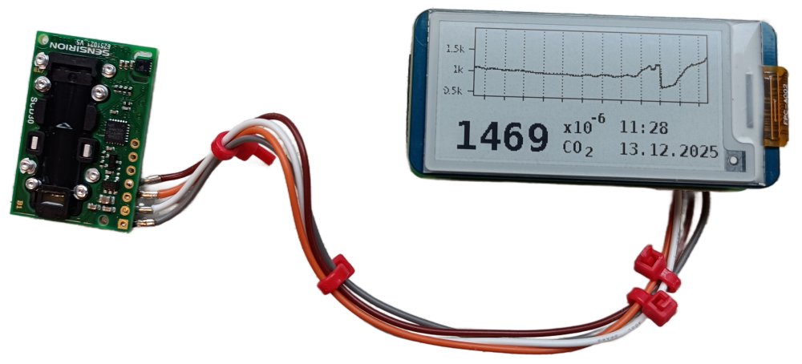
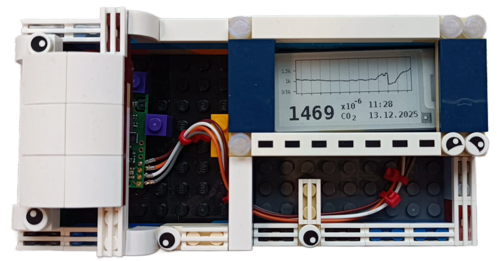
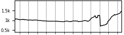
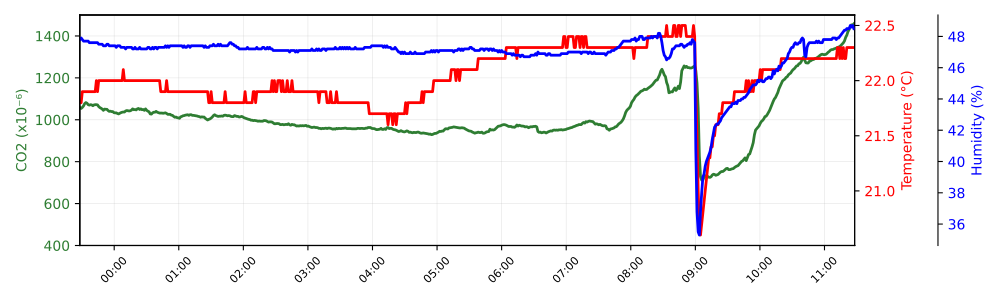
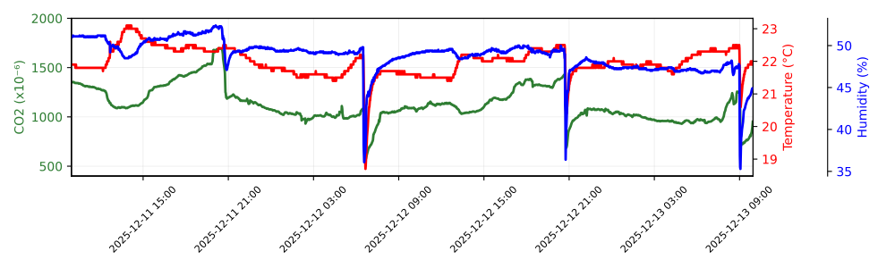
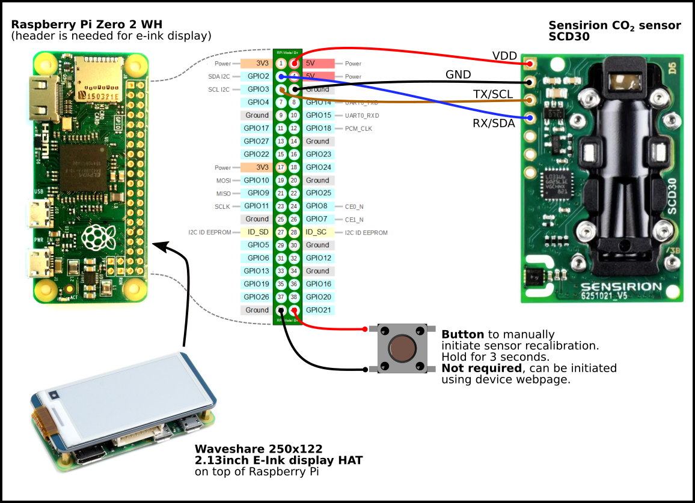
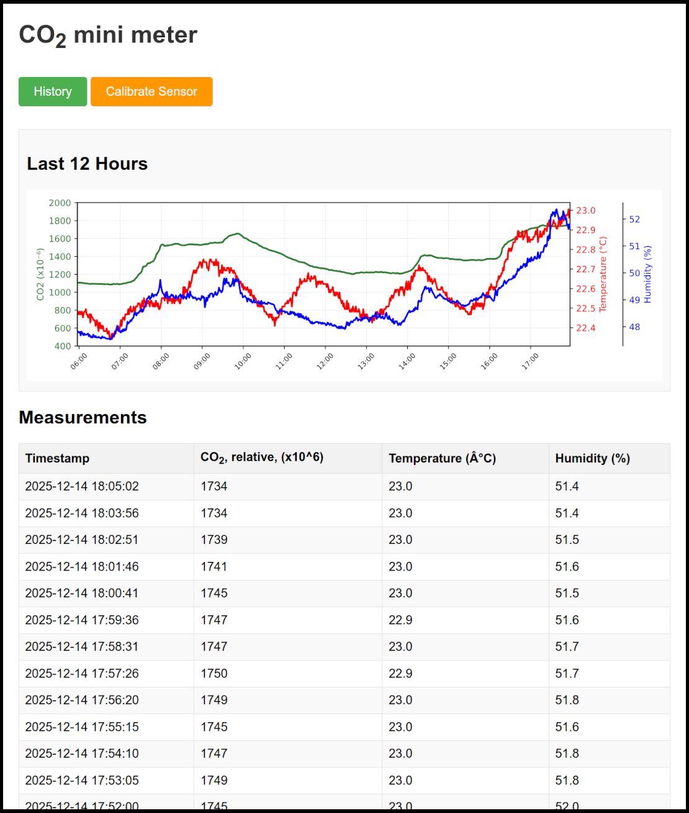
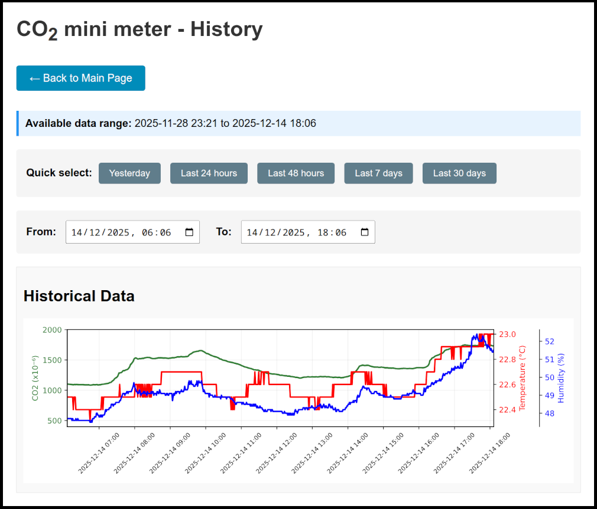

# CO<sub>2</sub> Mini Meter

A Raspberry Pi-based CO<sub>2</sub> concentration monitoring device with e-ink display and web interface for tracking indoor air quality.
99.9 % of the code was developed by AI Claude Sonnet 4.5 to test AI abilities. The system **is working** and used everyday in my home.

Photo of CO<sub>2</sub> Mini Meter showing real measurements on e-ink display:


Photo of CO<sub>2</sub> Mini Meter in a LEGO case made:


## 2. Overview

The CO<sub>2</sub> Mini Meter is a compact, air quality monitoring system designed to measure and display carbon dioxide levels, temperature, and humidity in indoor environments. The device features an easily readable e-ink display showing current CO<sub>2</sub> readings and a trend graph with last 12 hours, along with a web interface accessible from any device on your local network. Web interface can plot also historical values stored to a disk. Sensor calibration is manually triggered.

Last 12 hours of CO<sub>2</sub> concentration is shown on e-ink display. Every section between vertical lines represents one hour. The data on the following image shows real measurement with gradual decrease of CO<sub>2</sub> concentration during a night (because the room was empty), followed by increase during morning hours when people arrived to the room, and followed by sudden decrease during ventilation:



The same data is shown on webpage, and also with temperature and humidity:



The webpage also gives possibility to see historical data, e.g. last 48 hours:



## 3. Hardware Components

The device consists of the following hardware components:

- **Raspberry Pi** (any model with I2C and GPIO support)
- **Sensirion SCD30** CO<sub>2</sub> sensor module
  - Measures CO<sub>2</sub> concentration
  - Built-in temperature sensor
  - Built-in humidity sensor
  - I2C interface
- **Waveshare 2.13" e-Paper Display V4**
  - Black and white display
  - SPI interface via GPIO
  - size of Raspberry Pi Zero/Zero W
- **Power supply** for Raspberry Pi
- **Calibration button** for manually initiate sensor recalibration. Not needed, the same can be done using device webpage.

### 3.1. Connections

- **SCD30 Sensor**: Connected via I2C (default `/dev/i2c-1`)
- **E-ink Display**: Connected via SPI/GPIO using Waveshare e-Paper HAT
- **Calibration Button** (optional): Push button connected to GPIO 21 (pin 40) and GND for sensor calibration


*Wiring diagram showing connections between Raspberry Pi, e-Paper display, SCD30 sensor, and calibration button*

## 4. Software Features

### 4.1. Real-time Monitoring

- **Continuous Measurements**: Reads CO<sub>2</sub>, temperature, and humidity every 60 seconds
- **Sensor Warmup**: Automatically skips the first 2 readings after startup for sensor stabilization
  - Display shows "---" during warmup period or after sensor calibration instead of stale values
- **E-ink Display**:
  - Shows current CO<sub>2</sub> level in large digits
  - Displays current date and time
  - Shows a 12-hour trend graph (245×70 pixels) updated every 15 minutes
  - Configurable display orientation (normal or upside down)
  - **Note**: After startup, wait ~15 minutes for the first plot to be generated

### 4.2. Data Logging

- **CSV Storage**: All measurements saved to daily CSV files in the format:

  ```
  data/data_YYYY-MM-DD.csv
  ```

- **Data Fields**: Timestamp, CO<sub>2</sub> (×10⁶), Temperature (°C), Humidity (%)
- **Automatic Cleanup**: Maintains rolling 12-hour history in memory
- **Persistent Storage**: All historical data remains available in CSV files for long-term analysis

### 4.3. Web Interface

- **Real-time Dashboard**: Access via `http://[device-ip]:8080` or `http://[hostname].local:8080`
- **Auto-refresh**: Main page updates every 10 seconds
- **Interactive Plots**:
  - SVG plot showing 12-hour trends for all three parameters
  - CO<sub>2</sub> (green line, left axis) - auto-scaled from 400×10⁻⁶ to maximum value in data
  - Temperature (red line, right axis) - auto-scaled
  - Humidity (blue line, right axis, offset) - auto-scaled
  - Gap detection: Shows breaks in data when measurements are interrupted (e.g. restart of the device)
  - Date format: YYYY-MM-DD
  - **Note**: Plots are generated every 15 minutes. After device startup, wait ~15 minutes for the first plot to appear
- **Measurement Table**: Complete list of all measurements in the current 12-hour window with timestamp, CO<sub>2</sub>, temperature, and humidity
- **History Page**:
  - Access via "History" button on main page
  - View historical data from CSV files
  - Shows available time range of historical data
  - Manual date/time selection with datetime pickers
  - Quick select buttons: "Yesterday", "Last 24 hours", "Last 48 hours", "Last 7 days", "Last 30 days"
  - Dynamic plot generation based on selected time range
  - Adaptive time axis formatting (hourly for <24h, 6-hourly for <7 days, daily for longer periods)
  - All three parameters displayed with auto-scaled axes
- **Sensor Calibration**:
  - "Calibrate Sensor" button on main page
  - Initiates forced calibration to 427×10⁻⁶ (fresh outdoor air reference for year 2025)
  - Shows calibration progress with warning banner
  - Requires 2-minute stabilization period during calibration

Next image shows the main webpage interface:


Next image shows the history webpage interface:


### 4.4. Sensor Calibration

The SCD30 sensor can be calibrated to maintain accuracy over time:

- **Automatic Self-Calibration**: Disabled by default
- **Manual Forced Calibration**: Two methods available:
  1. **Hardware Button**: Hold button on GPIO 21 (pin 40) for 3 seconds
  2. **Web Interface**: Click "Calibrate Sensor" button on main page
- **Calibration Process**:
  - Device must be placed in fresh outdoor air (≈427×10⁻⁶ CO<sub>2</sub>)
  - Sensor stops normal measurements
  - 2-minute stabilization period
  - Forced calibration to 427×10⁻⁶ reference value
  - Resumes normal operation with 2-reading warmup
- **Visual Feedback**:
  - E-ink display shows "Recalibration..." message
  - Web interface shows warning banner with progress
  - Both update immediately when calibration is triggered

### 4.5. System Integration

- **Systemd Service**: Automatically starts on boot
- **mDNS/Avahi**: Device discoverable on network as `co2minimeter.local`
- **Fallback Mode**: For testing - runs with simulated data if sensor or display unavailable

### 4.6. Multi-threaded Architecture

The software uses five independent threads for optimal performance:

1. **CO<sub>2</sub> Sensor Thread**: Handles sensor communication and data collection
2. **E-ink Display Thread**: Updates the display based on measurement changes
3. **Plot Generator Thread**: Creates SVG and PNG plots every 15 minutes (initial plots generated ~15 minutes after startup)
4. **Web Server Thread**: Serves the web interface on port 8080
5. **Calibration Button Monitor Thread**: Monitors GPIO 21 for 3-second button press

### 4.7. Configuration

Key configuration constants (defined in `co2minimeter.py`):

- `CO2_MEASUREMENT_INTERVAL = 60` - Measurement interval in seconds
- `SENSOR_WARMUP_READINGS = 2` - Number of initial readings to skip
- `PLOT_UPDATE_INTERVAL = 900` - Plot update interval (15 minutes)
- `WEB_SERVER_PORT = 8080` - Web server port
- `HOURS_TO_KEEP = 12` - Rolling history window
- `CALIBRATION_BUTTON_PIN = 21` - GPIO pin for calibration button (pin 40)
- `CALIBRATION_REFERENCE_PPM = 427` - Reference CO<sub>2</sub> level for calibration
- `DISPLAY_UPSIDE_DOWN = False` - Set to `True` to rotate e-ink display 180°

## 5. Installation

Run the automated installation script:

```bash
cd /path/to/co2minimeter
chmod +x install.sh
./install.sh
```

The installer will:

- Install required system packages (Python, matplotlib, Pillow, Avahi)
- Configure mDNS for network discovery (IPv6 disabled to ensure reliable IPv4 resolution)
- Set up cron job to keep mDNS announcements active (workaround for Avahi announcement expiration issues)
- Create Python virtual environment
- Install SCD30 sensor driver
- Set up systemd service for auto-start

## 6. Usage

### 6.1. Manual Start

```bash
source venv/bin/activate
python3 co2minimeter.py
```

### 6.2. Service Management

```bash
# Start the service
sudo systemctl start co2minimeter.service

# Stop the service
sudo systemctl stop co2minimeter.service

# Check status
sudo systemctl status co2minimeter.service

# View logs
sudo journalctl -u co2minimeter.service -f
```

### 6.3. Accessing the Web Interface

- **Local**: `http://localhost:8080`
- **Network**: `http://co2minimeter.local:8080`
- **IP Address**: `http://[device-ip]:8080`
- **History Page**: Click "History" button on main page or navigate to `http://[device-ip]:8080/history`

## 7. File Structure

```
co2minimeter/
├── co2minimeter.py           # Main application
├── co2minimeter.service      # Systemd service file
├── co2minimeter_webpage.html # Main web interface template
├── co2minimeter_history.html # History page template
├── install.sh                # Installation script
├── requirements.txt          # Python dependencies
├── README.md                 # This file
├── fonts/                    # Display fonts
│   └── DejaVuSansMono-Bold.ttf
├── data/                     # Generated data (auto-created)
│   ├── data_YYYY-MM-DD.csv  # Daily CSV files
│   ├── data_latest_plot.svg # Main page plot (SVG)
│   ├── data_latest_plot.png # E-ink display plot (PNG)
│   └── history_plot.svg     # History page plot (SVG)
└── e-Paper/                  # Waveshare e-Paper library
```

## 8. Dependencies

### 8.1. System Packages

- `python3-venv`
- `python3-matplotlib`
- `python3-pil`
- `avahi-daemon`
- `avahi-utils`

### 8.2. Python Packages

- `sensirion-i2c-scd30` - SCD30 sensor driver
- `gpiozero` - GPIO interface for calibration button (system package)
- `matplotlib` - Plotting (system package)
- `Pillow` - Image manipulation (system package)

## 9. Troubleshooting

### 9.1. No sensor detected

- Check I2C connection: `i2cdetect -y 1`
- Look for device at address 0x61
- Verify sensor power supply

### 9.2. Display not updating

- Check GPIO connections
- Verify e-Paper library installation
- Check logs: `sudo journalctl -u co2minimeter.service`
- Update of CO<sub>2</sub> value is slow, and first 2 readings are discarded.

### 9.3. Web interface not accessible

- Check service status: `sudo systemctl status co2minimeter.service`
- Test mDNS: `avahi-resolve -n co2minimeter.local`
- Try IP address instead of hostname
- **Note:** IPv6 is disabled in Avahi configuration (`/etc/avahi/avahi-daemon.conf`) to prevent IPv4/IPv6 resolution conflicts. The device uses IPv4-only for mDNS.
- **Note:** A cron job runs every minute to refresh mDNS announcements (`avahi-resolve -n co2minimeter.local`). This works around an issue where Avahi announcements may expire on some networks. You can verify the cron job with `crontab -l` on the co2minimeter device.
- **Client-side mDNS configuration** (if `.local` domain doesn't resolve):
  
  On your client computer (Ubuntu/Debian), ensure mDNS is properly configured:
  
  1. **Install libnss-mdns:**

     ```bash
     sudo apt-get install libnss-mdns
     ```
  
  2. **Configure NSS** - Edit `/etc/nsswitch.conf`:

     ```bash
     sudo nano /etc/nsswitch.conf
     ```

     Find the `hosts:` line and ensure it includes mdns resolution:

     ```
     hosts:          files mdns4_minimal [NOTFOUND=return] resolve [!UNAVAIL=return] dns mdns4
     ```
  
  3. **Enable mDNS in systemd-resolved** - Edit `/etc/systemd/resolved.conf`:

     ```bash
     sudo nano /etc/systemd/resolved.conf
     ```

     Uncomment and set:

     ```ini
     [Resolve]
     MulticastDNS=yes
     LLMNR=yes
     ```

     Then restart the service:

     ```bash
     sudo systemctl restart systemd-resolved
     ```
  
  4. **Verify mDNS is working:**

     ```bash
     avahi-resolve -n co2minimeter.local
     ping co2minimeter.local
     ```

### 9.4. Service won't start

- Check Python virtual environment: `ls -la venv/`
- Verify permissions: `ls -la co2minimeter.py`
- Review logs: `sudo journalctl -u co2minimeter.service -n 50`

### 9.5. Calibration issues

- Ensure device is in fresh outdoor air (not indoors) before calibrating
- Wait full 2 minutes for stabilization
- Check GPIO 21 connection if using hardware button
- Verify button is connected between GPIO 21 (pin 40) and GND
- Check logs for calibration messages: `sudo journalctl -u co2minimeter.service -f`

## 10. License

This project uses the MIT license. The Waveshare e-Paper library got its own license, see `e-Paper/` directory. The font DejaVu Sans Mono use its own license, see `font/` directory.

## 11. 2DO

Things that might need improvement:

1. speed up loading of the csv files

## 12. Why? Motivation? Drivers?

Why yet another CO<sub>2</sub> meter project? Because I wanted something
running full Linux, that is easy for me to setup, and is fast enough to plot
historical data. Also I wanted an e-ink display due to readability. I have
found many Arduino and ESP32 based projects, but not one that fulfilled my
requirements. Also I could have bought a commercial meter at the price of
Raspberry Pi Zero + e-ink display + SCD30 sensor, but these simple devices
cannot record historical data. The ones recording data are much more expensive.
